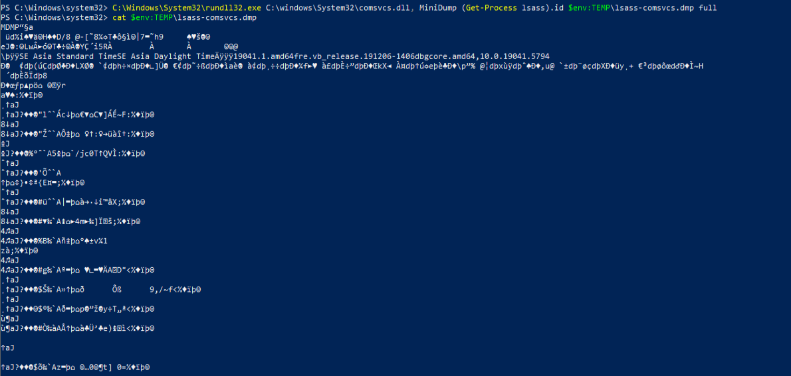
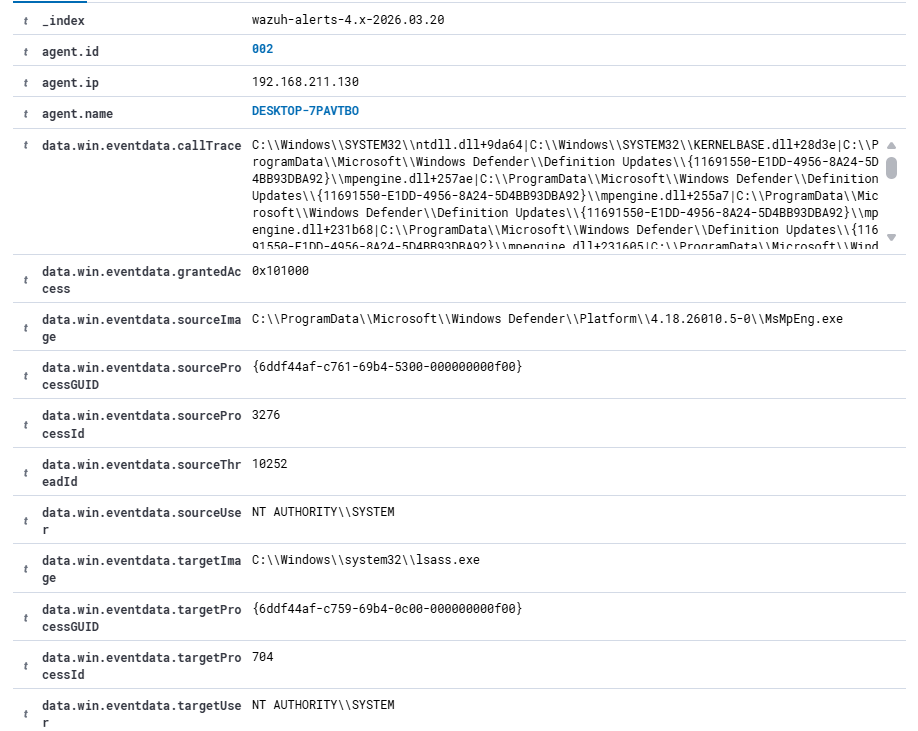
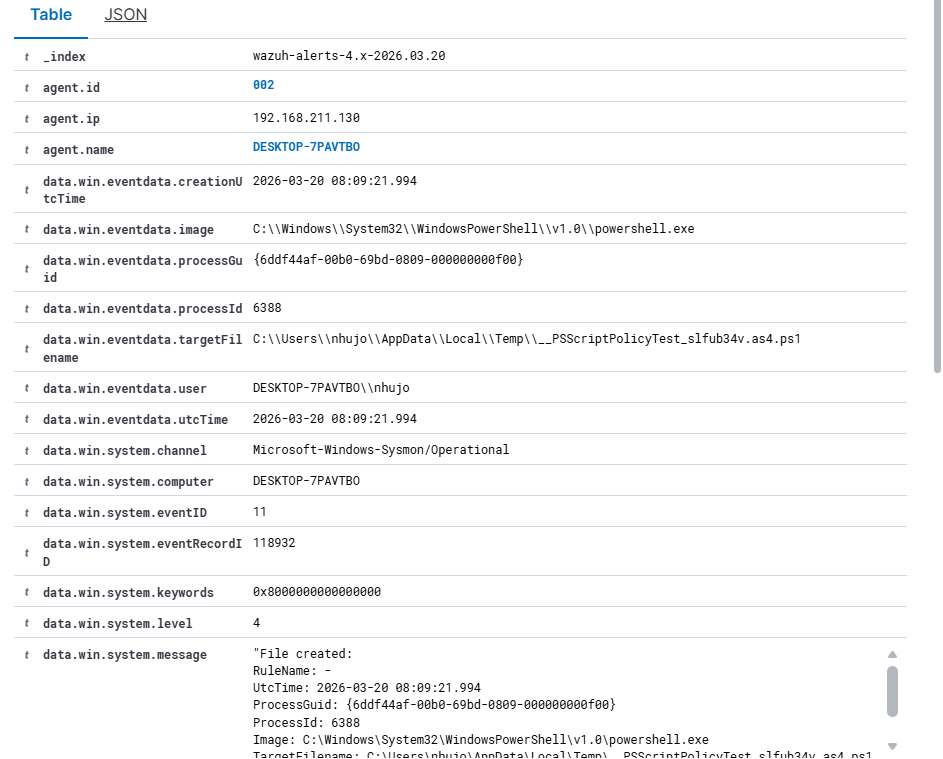
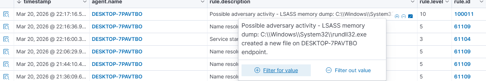

# T1003.001 WAZUH


# Báo cáo Phân tích và Phát hiện: Kỹ thuật LSASS Memory Dumping sử dụng `comsvcs.dll`

> **Mã kỹ thuật MITRE ATT&CK:** T1003.001 (OS Credential Dumping: LSASS Memory)
> **Mục tiêu:** Kiểm thử khả năng phát hiện hành vi trích xuất bộ nhớ của tiến trình `lsass.exe` bằng wazuh.

## 1. Tổng quan kịch bản
Kẻ tấn công thường nhắm vào tiến trình `lsass.exe` để đánh cắp thông tin đăng nhập lưu trong bộ nhớ dưới dạng bản rõ hoặc hash. 

Trong kịch bản này, kẻ tấn công sử dụng công cụ có sẵn của Windows là `rundll32.exe` để gọi hàm `MiniDump` từ thư viện hệ thống `comsvcs.dll`. Kỹ thuật này đặc biệt nguy hiểm vì nó không cần tải thêm bất kỳ mã độc nào từ bên ngoài , giúp né tránh sự phát hiện của các phần mềm diệt virus truyền thống.

## 2. Quá trình thực thi tấn công
Dựa theo kịch bản Atomic Red Team (Test #2: Dump LSASS.exe Memory using comsvcs.dll):
* **Nền tảng hỗ trợ:** Windows
* **Quyền hạn yêu cầu:** Administrator / System
* **Công cụ sử dụng:** PowerShell

Lệnh thực thi giả lập hành vi tấn công (tạo ra một bản sao bộ nhớ của `lsass.exe` và lưu vào thư mục `TEMP`):

C:\Windows\System32\rundll32.exe C:\windows\System32\comsvcs.dll, MiniDump (Get-Process lsass).id $env:TEMP\lsass-comsvcs.dmp full


Sau khi chạy thành công, một file dump chứa bộ nhớ LSASS sẽ được tạo ra tại đường dẫn: `$env:TEMP\lsass-comsvcs.dmp`.



Kết quả: Hệ thống sinh ra một tệp tin lưu trữ bộ nhớ tại đường dẫn `$env:TEMP\lsass-comsvcs.dmp`.
<!-- 
## 3. Cơ chế phát hiện trên SIEM Wazuh
Thay vì giám sát hành vi truy cập tiến trình vốn dễ bị bỏ lọt do sự thay đổi linh hoạt của các mã quyền (Access Mask như `0x1410`), chiến lược phòng thủ được chuyển hướng sang **giám sát hành vi sinh tệp tin (File Creation - Sysmon Event 11)**.

Hệ thống Wazuh được cấu hình thêm Rule tùy chỉnh (ID: 100011) với logic như sau:
* Lắng nghe các sự kiện tạo tệp tin mới (Sysmon Event 11 / Rule cha: 61613).
* Kiểm tra xem tệp tin được tạo ra có đuôi mở rộng là `.dmp` hay không.
* **Loại trừ (Whitelist):** Bỏ qua cảnh báo nếu chính tiến trình `lsass.exe` tự tạo ra file dump (tránh báo động giả). Nếu bất kỳ tiến trình nào khác (như `rundll32.exe`, `taskmgr.exe`) tạo ra tệp `.dmp`, hệ thống sẽ lập tức báo động.

### Cấu hình Wazuh Rule (`local_rules.xml`)
```xml
<group name="attack1,">
  <rule id="100011" level="10">
    <if_sid>61613</if_sid>
    <field name="win.eventData.targetFilename" type="pcre2">(?i)\\\\[^\\]*\.dmp$</field>
    <field name="win.eventData.image" negate="yes" type="pcre2">(?i)\\\\lsass.*</field>
    <description>Possible adversary activity - LSASS memory dump: $(win.eventdata.image) created a new file on $(win.system.computer) endpoint.</description>
    <mitre>
      <id>T1003.001</id>
    </mitre>
  </rule>
</group>
``` -->

## 3. Chuỗi sự kiện phát hiện 

Khi câu lệnh giả lập được kích hoạt, luồng sự kiện được ghi nhận trên hệ thống và xử lý theo trình tự thời gian như sau:

  * **[15:08:00] Thực thi câu lệnh:** Kẻ tấn công gọi tiến trình `rundll32.exe` từ PowerShell để thao tác với bộ nhớ LSASS.
  * **[15:08:08] Báo động giả từ Windows Defender :**
    Rule ID: 92900 - Cảnh báo truy cập LSASS.
    Level: 12 - Mức độ cảnh báo cao .
    Phân tích: Cảnh báo ghi nhận Windows Defender truy cập LSASS. Đây là hoạt động quét bộ nhớ định kỳ của trình diệt virus khi thấy có tác động vào hệ thống.
    Kết luận: Đây là báo động giả do trình diệt virus window defender tự quét hệ thống.
    
  * **[15:09:00] Báo động giả từ PowerShell :** 
    Rule ID: 92213 - Cảnh báo truy cập LSASS.
    Level: 15 - Mức độ cảnh báo cao nhất.
    Phân tích: Cảnh báo ghi nhận PowerShell tạo file `.ps1` trong thư mục Temp. Đây là hành vi kiểm tra chính sách thực thi mặc định của Windows mỗi khi PowerShell khởi chạy.
    Kết luận: Đây là báo động giả do Powershell khi tạo file .ps1 trong /tmp.
    
--> Tóm lại vẫn chưa bắt được LSASS Memory Dumping nên tạo file local rule.
  * **[22:17:1] Phát hiện chính xác bằng Local Rule :**
    Rule ID: 100011 
    Level: 10 - Mức độ cảnh báo cao.
    Phân tích: Sau khi cấu hình luật tùy chỉnh bắt file `.dmp`, Wazuh đã bắt chính xác hành vi `rundll32.exe` tạo tệp tin kết xuất bộ nhớ.
    Kết luận: Tấn công bị phát hiện thành công nhờ luật tùy chỉnh.
    


## 4. Cơ chế phát hiện tùy chỉnh 

Do các luật mặc định dễ bị nhiễu, chiến lược giám sát đã được chuyển hướng sang giám sát hành vi sinh tệp tin (File Creation - Sysmon Event 11).

### Cấu hình Wazuh Rule (local_rules.xml)
Luật `100011` được thiết kế để giám sát các tệp `.dmp` được tạo ra bởi bất kỳ tiến trình nào ngoại trừ chính `lsass.exe`.

```xml
<group name="attack1,">
  <rule id="100011" level="10">
    <if_sid>61613</if_sid>
    <field name="win.eventData.targetFilename" type="pcre2">(?i)\\\\[^\\]*\.dmp$</field>
    <field name="win.eventData.image" negate="yes" type="pcre2">(?i)\\\\lsass.*</field>
    <description>Possible adversary activity - LSASS memory dump: $(win.eventdata.image) created a new file on $(win.system.computer) endpoint.</description>
    <mitre>
      <id>T1003.001</id>
    </mitre>
  </rule>
</group>
```
## 5. Kết luận

Việc dựa hoàn toàn vào các luật mặc định thường dẫn đến tình trạng báo động giả cao từ các tiến trình hệ thống như Windows Defender hay PowerShell. Việc xây dựng Local Rule dựa trên dấu hiệu tệp tin đặc trưng (`.dmp`) là phương pháp hiệu quả nhất để phát hiện kỹ thuật Dump LSASS qua `comsvcs.dll`.