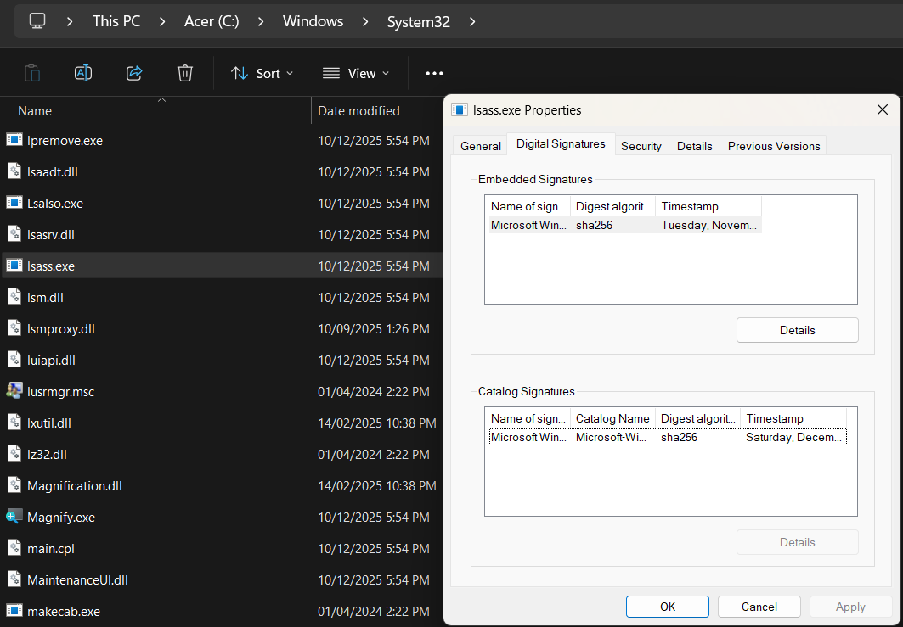
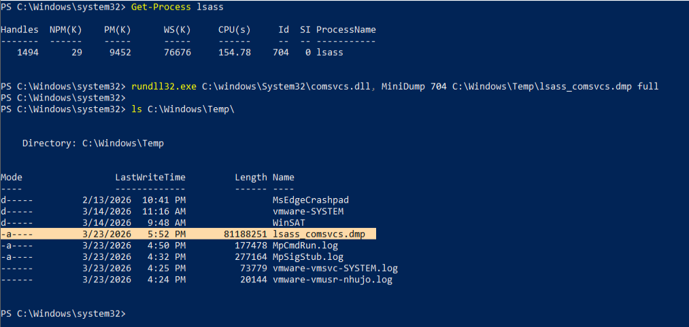
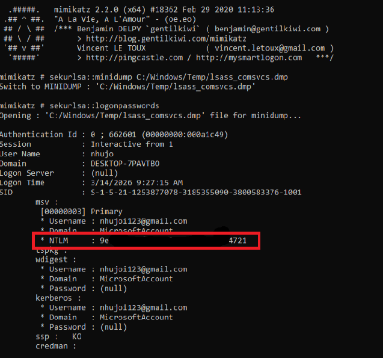
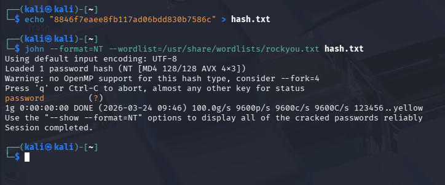
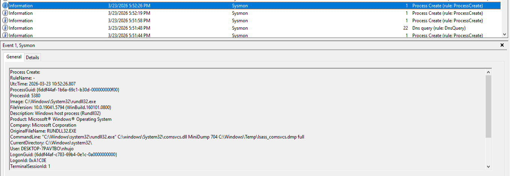
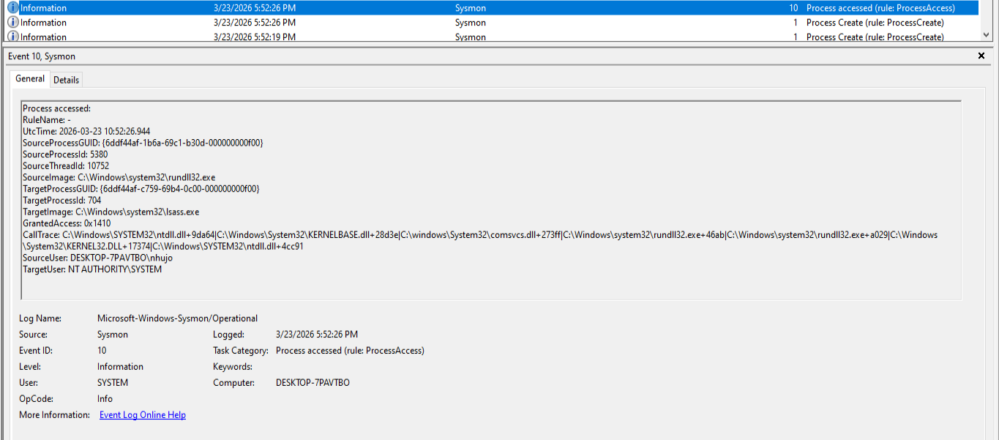
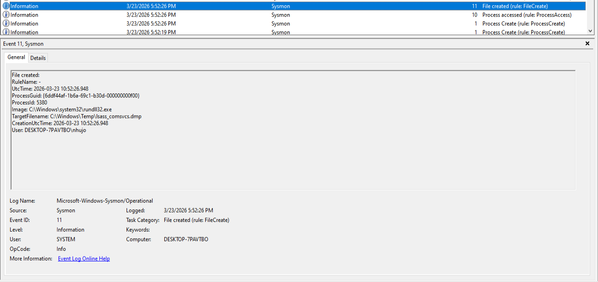

# Báo cáo phân tích và phát hiện: kỹ thuật LSASS Memory Dumping

> **Mã kỹ thuật MITRE ATT&CK:** T1003.001 (OS Credential Dumping: LSASS Memory)
> **Mục tiêu:** Kiểm thử khả năng phát hiện hành vi trích xuất bộ nhớ của tiến trình `lsass.exe`.

## 1. Tiến trình LSASS
lsass.exe là một tiến trình của Windows chịu trách nhiệm quản lý chính sách bảo mật cho hệ điều hành. Ví dụ, khi user đăng nhập vào tài khoản người dùng hoặc máy chủ Windows, lsass.exe sẽ xác minh tên đăng nhập và mật khẩu. Nếu tắt lsass.exe, user có thể sẽ bị đăng xuất khỏi Windows. lsass.exe cũng ghi vào nhật ký bảo mật Windows, vì vậy user có thể tìm kiếm ở đó các lần xác thực không thành công cùng với các vấn đề khác liên quan đến chính sách bảo mật.


## 2. Trích xuất thông tin đăng nhập từ tiến trình LSASS

### Bản chất của cuộc tấn công
Ý nghĩa: Khi người dùng đăng nhập vào Windows, hệ thống sẽ tạo ra và lưu trữ nhiều loại thông tin xác thực (như mật khẩu dạng cleartext, hàm băm NTLM, vé Kerberos) ngay trong bộ nhớ RAM của tiến trình lsass.exe. Kẻ tấn công (đã có quyền Administrator hoặc SYSTEM) sẽ nhắm vào bộ nhớ này để đánh cắp thông tin.

Mục đích: Khi có được các thông tin này, kẻ tấn công sẽ thực hiện di chuyển ngang, dùng tài khoản vừa lấy cắp để lây lan sang các máy tính khác trong cùng mạng nội bộ mà không cần phải bẻ khóa mật khẩu.

### Giả định kịch bản và thiết lập môi trường 

Trong khuôn khổ của bài nghiên cứu này, tính năng Real-time Protection của Windows Defender trên máy nạn nhân đã được cố ý vô hiệu hóa.

Lý do:

Mục tiêu nghiên cứu: trọng tâm của báo cáo là phân tích hành vi sinh log của hệ điều hành (thông qua Sysmon) và kiểm thử năng lực phát hiện của hệ thống SIEM/Wazuh, chứ không phải đánh giá khả năng phòng ngừa của các phần mềm Antivirus.

Tính thực tiễn của kịch bản: các công cụ và kỹ thuật như ProcDump hiện nay đã bị window defender nhận diện rất tốt. Tuy nhiên, trong các cuộc tấn công có chủ đích, khi kẻ tấn công đã giành được đặc quyền quản trị (Administrator/SYSTEM), kẻ tấn công thường sử dụng các kỹ thuật để vô hiệu hóa hoặc làm mù hệ thống antivirus. Việc tắt defender giúp mô phỏng chính xác giai đoạn sau xâm nhập khi lớp phòng thủ đầu tiên đã bị vô hiệu hóa, buộc tổ chức phải dựa vào lớp phòng thủ tiếp theo là giám sát log hệ thống.


## 3. Mô phỏng kỹ thuật tấn công
Để kiểm thử khả năng phát hiện của Wazuh, quá trình trích xuất bộ nhớ LSASS được thực hiện thông qua kỹ thuật lạm dụng thư viện comsvcs.dll. Kỹ thuật này không cần tải thêm file thực thi lạ nào xuống máy nạn nhân, mà sử dụng hàm MiniDump có sẵn của Windows:

### Tìm PID của lsass.exe
```PowerShell
Get-Process lsass
```

### Thực thi hàm dump bộ nhớ
rundll32.exe C:\windows\System32\comsvcs.dll, MiniDump PID C:\Windows\Temp\lsass_comsvcs.dmp full



Sau khi lấy được file .dmp, kẻ tấn công sẽ tải file này về máy tính cá nhân của kẻ tấn công. Tại đây, kẻ tấn công dùng Mimikatz chạy các lệnh như sekurlsa::Minidump (nạp file dump) và sekurlsa::logonPasswords (lấy mật khẩu).



Sau khi có mật khẩu dưới dạng hash thì kẻ tấn công có thể dùng johntheripper để đoán 




## 4. Phân tích Dấu hiệu nhận biết 
Hệ thống ghi log Sysmon được sử dụng để bắt các sự kiện ở mức độ hệ thống. Qua quá trình mô phỏng, ba loại Event ID chính đã được ghi nhận:

### 4.1. Sysmon Event ID 1: Process Creation 
Sự kiện này bắt được dòng lệnh gọi rundll32.exe nạp thư viện comsvcs.dll cùng từ khóa MiniDump.



### 4.2. Sysmon Event ID 10: Process Access 
Đây là dấu hiệu đáng tin cậy vì nó bắt đúng hành vi chạm vào bộ nhớ LSASS, bất kể kẻ tấn công dùng công cụ gì hay đổi tên file ra sao.


TargetImage: C:\Windows\System32\lsass.exe

GrantedAccess: Cấp quyền đọc bộ nhớ, thường xuất hiện với các mã Hex như 0x1fffff (full access) hoặc 0x1010, 0x1410.


### 4.3. Sysmon Event ID 11: File Create




## 5. Xây dựng luật phát hiện trên Wazuh

Dựa trên các dấu hiệu phân tích từ Sysmon Event ID 10, một custom rule được tạo trên Wazuh để cảnh báo tự động khi có tiến trình khả nghi truy cập vào LSASS.

```XML
<group name="windows, sysmon, lsass_access,">
  <rule id="100050" level="12">
    <if_group>sysmon_event_10</if_group>
    <field name="win.eventdata.targetImage" type="pcre2">(?i)lsass\.exe</field>
    <field name="win.eventdata.grantedAccess" type="pcre2">0x1fffff|0x1010|0x1410</field>
    <description>Phát hiện hành vi truy cập bộ nhớ LSASS đáng ngờ (Khả năng Dump Credential)</description>
    <mitre>
      <id>T1003.001</id>
    </mitre>
  </rule>
</group>

```

Sau khi mô phỏng tấn công lại thì đã bắt được hành vi lsass trên wazuh


## 6. Kết luận:
Bài báo cao đã thực hiện mô phỏng thành công kỹ thuật OS Credential Dumping (T1003.001) và xây dựng được năng lực giám sát, phát hiện cảnh báo trên hệ thống Wazuh thông qua việc phân tích log Sysmon.

Do giới hạn của môi trường thực nghiệm (Lab cá nhân), hệ thống không được triển khai các phần mềm doanh nghiệp như hệ thống Antivirus (AV/EDR), công cụ sao lưu (Backup Agents) hay phần mềm giám sát (Monitor). Trong môi trường thực tế, các phần mềm hợp lệ này thường xuyên phải truy cập vào bộ nhớ lsass.exe để thực thi tác vụ, dẫn đến việc Rule 100050 có thể sinh ra một lượng lớn cảnh báo giả. 
